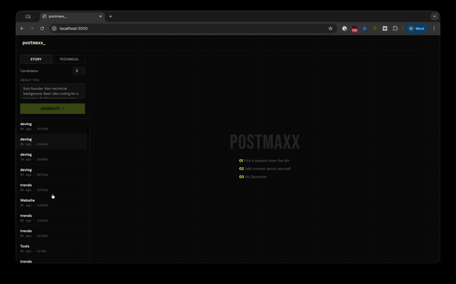
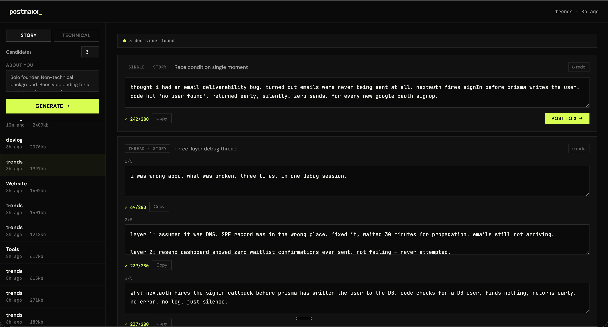

# postmaxx_

Turn your coding sessions into building-in-public posts. Surfaces the **reasoning** behind your decisions — not changelogs, not hype.

Works with **Claude Code**, **opencode**, and **OpenAI Codex** sessions.





## Requirements

- Node.js 18+
- An Anthropic API key — get one at [console.anthropic.com/settings/keys](https://console.anthropic.com/settings/keys)
- At least one session from Claude Code, opencode, or Codex

## Setup

**1. Clone and enter the repo**
```bash
git clone https://github.com/myrondoesnotcode/postmaxxing
cd postmaxxing
```

**2. Add your Anthropic API key**
```bash
echo 'ANTHROPIC_API_KEY=sk-ant-...' > .env
```

**3. Open the UI**
```bash
node postmaxx.js --ui
```

Opens at [http://127.0.0.1:3000](http://127.0.0.1:3000). Pick a session, generate candidates, edit and post.

## UI features

- **Source tabs** — filter by tool: All / CC (Claude Code) / OC (opencode) / CX (Codex). Only shows tabs for sources that have sessions on your machine.
- **Model picker** — choose Haiku (~$0.001), Sonnet (~$0.003), or Opus (~$0.015) per run for Stage 2 generation. Stage 1 always uses Haiku.
- **Session preview** — click any session to see an excerpt before generating.
- **Story vs Technical mode** — story surfaces product reasoning; technical surfaces stack decisions, trade-offs, and numbers.

## CLI (optional)

If you prefer the terminal:

```bash
node postmaxx.js                    # most recent session, prints to terminal
node postmaxx.js --list             # pick a session interactively
node postmaxx.js --mode technical   # engineering lens instead of story
node postmaxx.js --count 3          # generate 3 candidates
node postmaxx.js --days 7           # look back 7 days
node postmaxx.js --project myapp    # filter by project name
node postmaxx.js --context "text"   # hint prepended to session
```

## Posting threads

Add a Typefully API key to post threads directly from the UI or CLI:
```
TYPEFULLY_API_KEY=your-key-here
```

Get one free at [typefully.com](https://typefully.com) → Settings → API.

Single tweets post directly to X via the browser. Threads go through Typefully.
